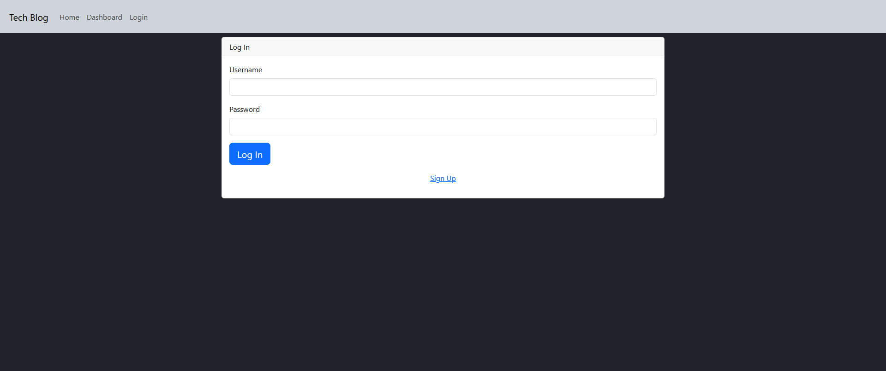

# Tech Blog (MVC Fullstack Webpage)

## Description

Provide a short description explaining the what, why, and how of your project. Use the following questions as a guide:

- What was your motivation?
- Why did you build this project? (Note: the answer is not "Because it was a homework assignment.")
- What problem does it solve?
- What did you learn?

This project was created to get a better understanding of creating a fullstack web app with MVC structure. A blog-style website is a great example to begin with, as it is very intuitive to structure its models and has a simple view. I learned a lot about the dynamics of a MVC structure and how each part interacts with the other.

## Installation

Use `npm i` to install all required modules

## Usage

Visit [this link]() to access the website on Heroku.

NOTE: project is not finished, i have no time or sanity left

## Credits

N/A

## License

N/A

